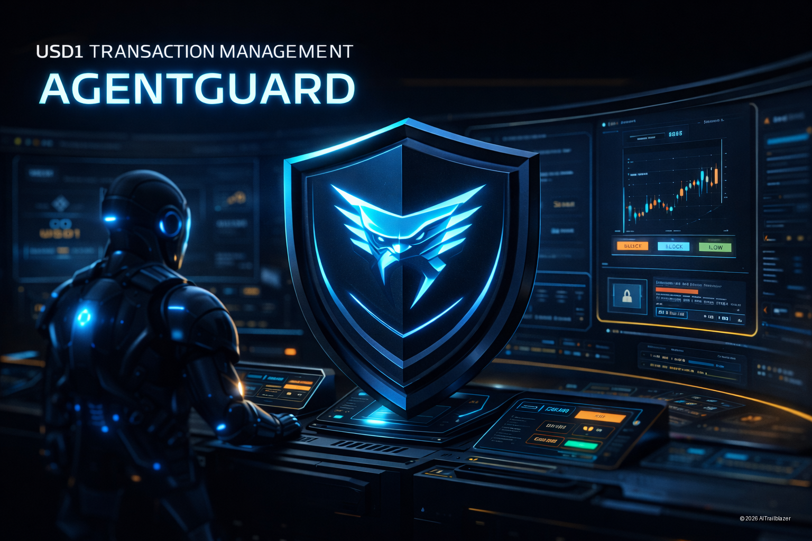

<p align="center">
  
</p>

<h1 align="center">AgentGuard</h1>

<p align="center">
  <strong>Pre-execution controls for AI-driven payments built on AgentPay.</strong>
</p>

<p align="center">
  Built on day one of the AgentPay SDK release.
</p>

<p align="center">
  
  
  
  
  
</p>

<p align="center">
  <a href="#why-agentguard">Why AgentGuard</a> ·
  <a href="#how-it-works">How It Works</a> ·
  <a href="#current-status">Current Status</a> ·
  <a href="#roadmap">Roadmap</a> ·
  <a href="#security-notice">Security</a>
</p>

> AgentPay secures execution. AgentGuard governs intent.

AgentGuard is a pre-execution governance layer for AI-driven financial operations. It sits above AgentPay and answers the question that most payment systems leave unresolved:

**Should this transaction be attempted at all?**

Before a payment reaches a signer, AgentGuard is designed to evaluate intent, policy, approval state, agent identity, and workflow context. The goal is simple: keep self-custodial execution intact while adding a serious control plane above it.

## Why AgentGuard

AI agents can move money faster than most teams can review intent.

That changes the risk surface. The missing layer is not another wallet. The missing layer is a decision system that can:

- block unsafe transactions before they reach the signing boundary
- enforce spending and workflow rules across multiple agents
- request human review when thresholds or counterparties require it
- create a durable audit trail for approvals, denials, and exceptions

AgentPay already provides a strong local execution boundary. AgentGuard is intended to complement that boundary, not replace it.

## What AgentGuard Is

AgentGuard is:

- a pre-execution control layer
- a policy and workflow coordinator
- an audit and visibility surface for agent-driven money movement
- a way to separate intent review from transaction execution

AgentGuard is not:

- a wallet
- a custody system
- a signer
- a replacement for AgentPay's local policy and signing model

## Why This Architecture Matters

Most agent payment systems collapse decision-making and execution into one layer.

That is the wrong abstraction.

The cleaner model is:

1. AgentGuard decides whether an action should be attempted.
2. AgentPay enforces local policy and signing at the execution boundary.
3. The chain only sees transactions that survive both layers.

That separation makes the system easier to reason about, easier to audit, and safer to operate.

## AgentGuard vs AgentPay

| Responsibility | AgentGuard | AgentPay |
| --- | --- | --- |
| Decide whether a transaction should be attempted | Yes | No |
| Enforce cross-agent or system-level orchestration rules | Yes | Limited |
| Route to human review when business policy requires it | Planned | Local-first manual approval |
| Provide multi-workflow audit visibility | Yes | Partial |
| Hold custody of keys | No | Yes |
| Sign transactions locally | No | Yes |
| Enforce local transaction policy before signing | No | Yes |

## Example Decision

| Input | Value |
| --- | --- |
| Requested action | Transfer `100 USD1` to recipient `X` |
| Policy | Autonomous spend limit for this agent is `50 USD1` |
| Result | Blocked before AgentPay execution |

Example CLI surface:

```bash
agent-guard transfer --amount 100 --to 0x...
```

Expected outcome:

```text
DENIED
reason: exceeds autonomous spend threshold
action: require manual approval
```

If the request is allowed:

```bash
agent-guard transfer --amount 10 --to 0x...
```

```text
ALLOWED
next: delegating execution to AgentPay
```

## How It Works

```text
AI Agent / Workflow
        |
        v
AgentGuard
- validate intent
- enforce orchestration rules
- check thresholds and counterparties
- request review if required
        |
        v
AgentPay CLI / daemon
- local policy enforcement
- local signing boundary
        |
        v
Blockchain / settlement rail
```

Execution flow:

1. An agent or operator proposes an action.
2. AgentGuard evaluates the request against higher-level rules.
3. If denied, the action stops before execution.
4. If allowed, AgentGuard delegates the transaction to AgentPay.
5. AgentPay performs local policy checks and signing.
6. The signed transaction is returned for broadcast.

## Design Principles

- **Policy before signature.** Unsafe intent should be blocked before any signing path is reached.
- **Self-custody preserved.** AgentGuard should not weaken AgentPay's local-first trust model.
- **Human review stays available.** Automation should escalate, not silently override, when risk increases.
- **Auditability matters.** Every allow, deny, and escalation should be explainable after the fact.
- **Multi-agent safety matters.** Controls should work across workflows, not only inside one wallet runtime.

## What Is AgentPay?

AgentPay is a local, self-custodial runtime for blockchain transaction execution with built-in policy enforcement.

It is developed by World Liberty Financial (WLFI) and released as an open-source SDK. At a high level, AgentPay provides:

- a CLI interface for initiating actions
- a local daemon for wallet access, approvals, and signing
- a policy-aware execution boundary before any signature is produced

AgentPay official site:

- [agentpay.worldlibertyfinancial.com](https://agentpay.worldlibertyfinancial.com/)

For AgentGuard, the important takeaway is this:

**AgentPay is the execution substrate. AgentGuard is the decision layer above it.**

## Current Status

This repository is intentionally honest about its maturity.

What exists today:

- product framing and architecture
- analysis of the AgentPay SDK and trust boundaries
- a clear integration thesis for a pre-execution control layer
- a runnable MVP CLI with mocked AgentPay execution
- a persistent pending-approval queue for approval-eligible blocks
- Slack approval routing with Approve and Reject buttons
- Slack signature verification on interactive approval actions
- persistent transaction records for pending, approved, and rejected flows
- an initial roadmap for the next iteration

What does not exist yet:

- a production-ready policy engine
- a completed live AgentPay integration
- audited release artifacts
- a full approval and orchestration layer

If you are here early, this is the right way to read the repo:

**The concept is real. The architecture is serious. The implementation is still early.**


## Quick Start

Install dependencies:

```bash
npm install
```

Run the MVP in mock mode:

```bash
npm run start -- 0x1111111111111111111111111111111111111111 100000000000000
```

Expected flow:

```text
✅ ALLOWED by AgentGuard
[AgentPay MOCK]
🚀 Executed via AgentPay:
mock-tx-hash-0x123
```

Blocked example:

```bash
npm run start -- 0x9999999999999999999999999999999999999999 100000000000000
```

Expected result:

```text
❌ BLOCKED: DENIED: recipient not allowed
```

For API-driven approval flow:

```bash
npm run api
```

For Slack approval flow, create a local `.env` from `.env.example` and set both:

```bash
SLACK_WEBHOOK_URL=...
SLACK_SIGNING_SECRET=...
```

When an approval-eligible transaction is blocked, AgentGuard persists the request and can route it into Slack with Approve and Reject buttons through `POST /slack/actions`. The CLI fallback remains:

```bash
npm run approve -- <tx-id>
```

You can inspect durable approval state over HTTP:

```bash
curl http://localhost:3000/transactions
```

If you want AgentGuard state to live outside the repo, set `AGENTGUARD_STATE_DIR` before starting the API. Absolute paths are supported:

```bash
AGENTGUARD_STATE_DIR=/Volumes/BIGDATA/agentguard-state/ait-agent-guard npm run api
```

This is useful if your primary data volume is tight on free space and you want the pending queue and transaction ledger on another disk.

## How to Test

### 1) Verify install

```bash
node -v
npm -v
```

### 2) Install dependencies

```bash
npm install
```

### 3) Run (mock mode)

```bash
npm run start -- 0x1111111111111111111111111111111111111111 100000000000000
```

Expected output:

```text
✅ ALLOWED by AgentGuard
[AgentPay MOCK]
🚀 Executed via AgentPay:
mock-tx-hash-0x123
```

### 4) Test a blocked transaction

```bash
npm run start -- 0x9999999999999999999999999999999999999999 100000000000000
```

Expected output:

```text
❌ BLOCKED: DENIED: recipient not allowed
```

### 5) Toggle real AgentPay (optional)

```bash
AGENTGUARD_USE_MOCK=false npm run start -- 0x1111111111111111111111111111111111111111 100000000000000
```

> Requires a local AgentPay runtime (`agentpay admin setup`) and proper network configuration.

### 6) What this validates

- Pre-execution validation runs before any signing path
- Allowed transactions are delegated to the execution layer
- Blocked transactions never reach AgentPay

## Current Execution Mode

AgentGuard currently runs with a mocked AgentPay execution layer for development.

That means the control loop is real:

- input
- validation
- allow or deny decision
- execution handoff

But the final transaction call is still simulated by default.

To switch to the real AgentPay path later:

```bash
AGENTGUARD_USE_MOCK=false npm run start -- 0x1111111111111111111111111111111111111111 100000000000000
```

Full end-to-end execution requires a local AgentPay runtime installed and configured on the machine.

## Repository Map

| Path | Purpose |
| --- | --- |
| [`README.md`](README.md) | Public overview, architecture framing, and roadmap |
| [`analysis/worldliberty-agentpay-sdk-analysis.md`](analysis/worldliberty-agentpay-sdk-analysis.md) | Technical analysis of AgentPay and the proposed integration posture |
| [`agentguard_with_copyright.png`](agentguard_with_copyright.png) | Project hero artwork |

## What To Read First

1. Start with this README for the product thesis and system model.
2. Read [`analysis/worldliberty-agentpay-sdk-analysis.md`](analysis/worldliberty-agentpay-sdk-analysis.md) for the architecture deep dive.
3. Use the analysis to evaluate where AgentGuard should integrate and where it should not.

## Early Use Cases

- limit autonomous treasury actions by agent, workflow, or time window
- require approval for large USD1 transfers before execution starts
- block payments to unapproved counterparties
- coordinate budgets across multiple agents using one policy plane
- add audit visibility to agent-driven payment operations

## Roadmap

### Phase 1

- CLI preflight wrapper for transaction validation
- basic thresholds and counterparty checks
- local audit logging
- AgentPay command delegation for approved actions

### Phase 2

- configurable policy packs
- approval routing for higher-risk actions
- richer transaction explanations and deny reasons
- better operator visibility into agent behavior

### Phase 3

- multi-agent budget coordination
- policy orchestration across workflows
- observability and audit dashboard
- advanced control logic for production environments

## Why This Project Could Matter

If agent payments become common, the market will need more than wallets and signers.

It will need:

- systems that understand intent
- controls that work before execution
- trust boundaries that remain local and inspectable
- operator tools that let humans keep authority without slowing everything to a halt

That is the category AgentGuard is trying to define.

## Security Notice

This project is about adding control logic around financial transactions.

- Review all code before use.
- Do not use with significant funds.
- Expect breaking changes during early development.
- Treat all examples as experimental until a real implementation is released.
- Do not assume this repository has been audited.

## Relationship to AgentPay

AgentGuard is not affiliated with World Liberty Financial (WLFI).

It is an independent open-source project intended to extend AgentPay with a separate governance and coordination layer.

## About

Built by AITrailblazer.

AgentGuard is part of ongoing work around agent orchestration, real-world execution, and safer control systems for autonomous financial operations.

## License

[MIT](LICENSE)

© 2026 AITrailblazer
